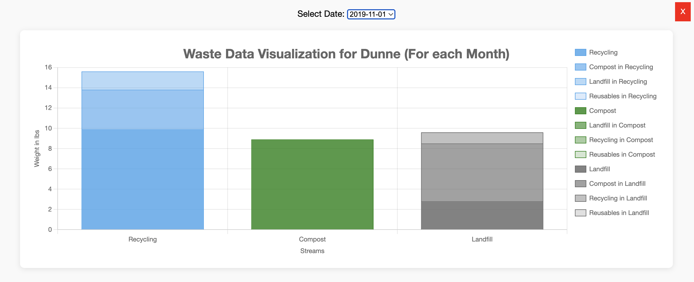
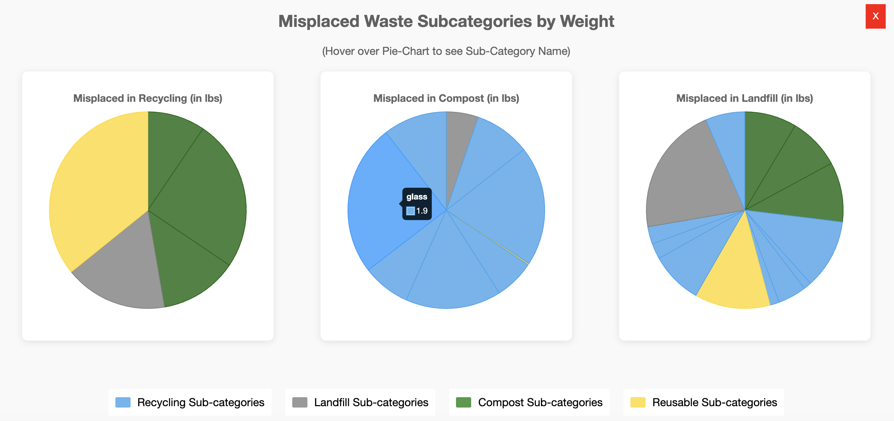

# Data Visualization Project

A data visualization project using **JavaScript** and **Python** to explore and represent waste generation and placement patterns at **Santa Clara University**. These insights can aid in promoting sustainable practices across campus facilities.






## Table of Contents

- [Dataset](#dataset)
- [Project Structure](#project-structure)
- [Getting Started](#getting-started)
  - [JavaScript Visualizations](#javascript-visualizations)
  - [Python Visualizations](#python-visualizations)
- [Dependencies](#dependencies)
- [Usage](#usage)
- [Contributing](#contributing)
- [License](#license)

## Dataset

This project uses data related to waste generation and categorization across university buildings and departments. It includes statistics such as stream types (landfill, recycling, compost), substreams, and corresponding weights over time.

## Project Structure

```
.
├── javascript/                # JavaScript-based visualizations
│   └── home.html             # Main HTML file with D3 visualizations
├── python/                   # Python-based visualizations
│   └── waste_plot.py        # Example visualization using Matplotlib
├── three-container-system-01.jpg  # Reference image for waste types
└── README.md                 # Project documentation
```

## Getting Started

### JavaScript Visualizations

1. Navigate to the JavaScript directory:

   ```
   cd javascript
   ```

2. Open the `home.html` file in a web browser to view the interactive charts.

### Python Visualizations

1. Navigate to the Python directory:

   ```
   cd python
   ```

2. Run the Python script:

   ```
   python waste_plot.py
   ```

   Ensure the required libraries are installed (see Dependencies).

## Dependencies

### JavaScript

- [D3.js](https://d3js.org/): For interactive data visualizations in the browser.

### Python

- [Pandas](https://pandas.pydata.org/): For data manipulation.
- [Matplotlib](https://matplotlib.org/): For plotting graphs.

To install Python dependencies:

```
pip install pandas matplotlib
```

## Usage

This project helps visualize and understand waste distribution across departments and buildings. It supports:

- Identifying major waste contributors
- Understanding waste stream trends
- Promoting informed sustainability decisions

## Contributing

Contributions are welcome! To contribute:

1. Fork the repository.
2. Create a new branch.
3. Make your changes.
4. Submit a pull request.

Please ensure your changes are clearly documented and maintain consistency with the existing code.

## License

This project is licensed under the MIT License. See the [LICENSE](LICENSE) file for more details.
