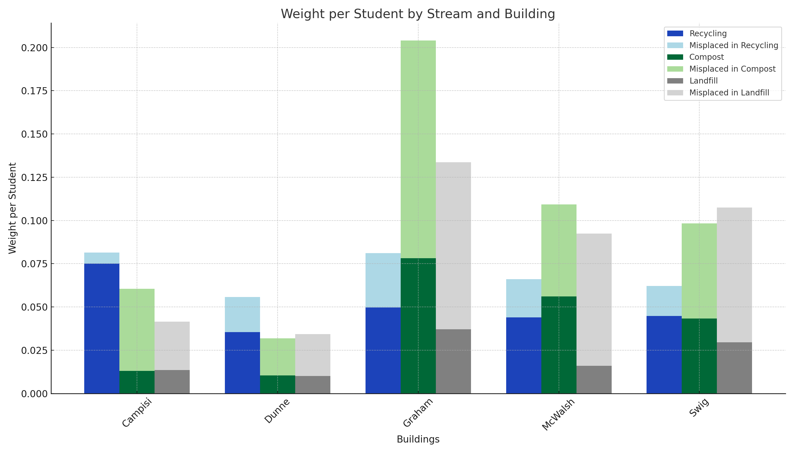

# Waste Management Data Visualization

This project visualizes waste generation and misplacement patterns across five residential buildings at Santa Clara University, using data from 2018 to 2020. The goal is to identify trends and areas for improvement in sustainability practices through clear, static visualizations.

## Overview

The dataset contains monthly weights of compost, recycling, and landfill waste streams, including misplacements. The analysis focuses on the buildings with the most data (Graham and Swig) and adjusts for student population size to normalize results.

## Key Features

- **Normalized Waste per Student**: Monthly waste generation and placement is adjusted for building population size to provide fair comparisons.
- **Misplacement Grouping**: Misplaced waste is categorized into "Misplaced in Compost", "Misplaced in Recycling", and "Misplaced in Landfill".
- **Median-based Aggregation**: Used to handle data skew and outliers.
- **Bar Graphs with CalRecycle Color Scheme**: Helps visually track proper vs misplaced waste over time.

## Insights

- **Graham** shows the highest per-student waste and misplacement into recycling.
- **Swig** has a rising trend in misplaced waste, converging with Graham’s performance.
- These patterns can inform campus strategies for better bin placement and student education.

## Visualizations

- Grouped and stacked bar charts comparing monthly and per-capita waste streams.
- Separate visual breakdowns for Graham and Swig buildings.

## Tools Used

- Python (Pandas, Matplotlib)
- Static data preprocessing and charting

## Conclusion

These visualizations offer actionable insights to improve waste management practices on campus. They support targeted efforts to reduce environmental impact and promote sustainable living.

## Reference

[CalRecycle Bin Color Standards](https://calrecycle.ca.gov/organics/slcp/collection/systems/#:~:text=Green%20Container%3A%20Limited%20to%20food,is%20not%20organic%20or%20recyclable.)
